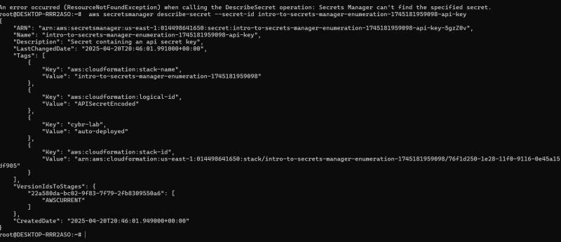
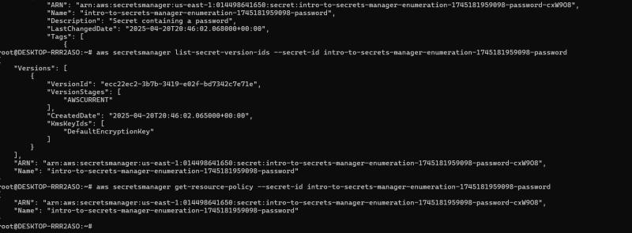

# AWS Secrets Manager Security Audit & Threat Modeling

This project demonstrates a security audit of AWS Secrets Manager within a sandboxed environment. The primary goal was to identify and analyze misconfigurations in IAM roles and secret access controls, simulating both insider threat and external adversary reconnaissance scenarios.

---

## Project Overview

AWS Secrets Manager is a critical service for securely storing and managing secrets like API keys, database credentials, and passwords. However, misconfigurations can lead to significant security vulnerabilities, including unauthorized access and data exfiltration. This audit leverages the AWS CLI to perform deep-dive analysis of secret configurations, IAM permissions, and resource-based policies to uncover potential weaknesses.

---

## Threat Model & Audit Workflow

The audit process was guided by a threat model that considered two primary adversary types: an **External Attacker** with compromised credentials and a malicious or negligent **Insider Threat** with overprivileged access. The diagram below illustrates the attack paths and enumeration techniques used to assess the security posture of Secrets Manager.

### Figure 1 – Threat Model & Audit Workflow
*This diagram outlines the simulated attack vectors and the corresponding AWS CLI actions used for reconnaissance and analysis. It highlights how actors like auditors, overprivileged roles, or external attackers interact with Secrets Manager and how misconfigurations can lead to secret exposure.*
 

---

## Methodology & Findings

The audit followed a systematic approach: initial enumeration, deep inspection of individual secrets, and policy analysis. The following figures document the commands executed and the intelligence gathered at each stage.

### Figure 2 – Initial Secret Enumeration (`list-secrets`)
*The first step involved using the `list-secrets` command to discover all secrets stored within the target region. This provides a high-level overview of available secrets and their metadata, forming the basis for further investigation.*
 

 

### Figure 3 – Extracting Secret Metadata (`describe-secret`)
*With a list of secret ARNs, the `describe-secret` command was used to retrieve detailed metadata for a specific secret. This revealed its description, tags, and the ARN of the associated AWS KMS key used for encryption, which are crucial details for an attacker.*
 

 

### Figure 4 – Inspecting Version History & Resource Policies
*To understand the secret's lifecycle and access controls, `list-secret-version-ids` and `get-resource-policy` were executed. These commands expose the history of secret versions (potential for accessing old, leaked credentials) and any resource-based policies that might grant unintended cross-account access.*
 

 

### Figure 5 – Analyzing an Overly Permissive IAM Policy
*The core of the audit involved analyzing the IAM policies governing access to Secrets Manager. This example shows a policy granting broad permissions (`secretsmanager:*` and `iam:Get*`) which represents a critical misconfiguration. Such policies violate the **principle of least privilege** and allow an entity to not only read secrets but also modify permissions, creating a significant security risk.*
 

---

## 📝 Key Takeaways

| Finding | Figure Reference | Impact |
| :--- | :--- | :--- |
| **Overprivileged IAM Role** | Figure 5 | A compromised entity with this role could enumerate, read, and modify all secrets, potentially leading to full environment compromise. |
| **Lack of Granular Access Control** | Figure 5 | The policy uses a wildcard (`*`) instead of specifying individual secret ARNs, granting excessive permissions beyond the role's intended function. |
| **Exposed Metadata** | Figure 3 | Descriptive names and tags can inadvertently leak sensitive contextual information about a secret's purpose to low-privilege users. |

---

## 🚀 Skills Demonstrated

-   **Cloud Security Auditing:** Performed a systematic security assessment of a core AWS service.
-   **AWS Secrets Manager:** Deep understanding of its architecture, configuration, and security best practices.
-   **IAM & Access Control:** Analyzed and identified misconfigurations in IAM roles and resource-based policies.
-   **Threat Modeling:** Modeled realistic attack scenarios for insider threats and external enumeration.
-   **AWS CLI Proficiency:** Utilized powerful CLI tools (`describe-secret`, `list-secrets`, `get-resource-policy`) for adversary-style reconnaissance.
-   **Security Posture Validation:** Conducted hands-on validation of security controls in a sandboxed AWS environment.
